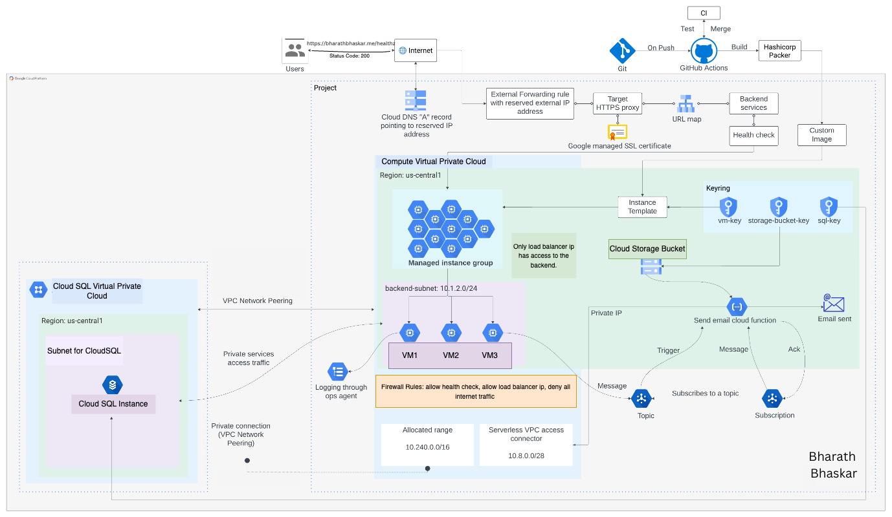

## User Management Application on GCP using Terraform

This repository hosts the code for a RESTful API built with Python and Flask, designed to manage user data through CRUD operations and health checks. The API is deployed on Google Cloud Platform (GCP) and uses Terraform for automating infrastructure and Hashicorp Packer for creating custom images.

### Features

- **User Management:** Supports CRUD operations to manage user data efficiently.
- **Health Checks:** Provides an endpoint to monitor the health of the application and connected services.
- **Secure Setup:** Utilizes SSL certificates for HTTPS and customer-managed encryption keys to enhance data security.
- **Scalability:** Enables high availability and scalability using managed instance groups and load balancing.
- **Event Handling:** Integrates Google Pub/Sub with Cloud Functions to send verification emails via Mailgun.

### Architecture

The project implements a layered cloud architecture that optimizes for high availability and secure, scalable performance. Below is an illustration of the cloud architecture setup:

**Cloud Architecture Diagram**



### Key Technologies and Implementations

- **Infrastructure as Code (IaC):** Utilizes Terraform to automate the setup of cloud resources like VPCs, subnets, and routing tables, ensuring a consistent and repeatable configuration across environments.
- **Custom Machine Images:** Uses Hashicorp Packer to create custom virtual machine images on CentOS Stream 8, optimizing deployment efficiency and ensuring consistency.
- **CI/CD:** Implements GitHub Actions to automate testing, build Docker images, and manage rolling updates, streamlining the development workflow.
- **Database Configuration:** Configures a private CloudSQL instance with VPC peering for secure database interactions. Credentials are dynamically managed via VM metadata, enhancing security and integration ease.
- **Monitoring and Logging:** Employs Google Ops Agent on virtual machines to collect application logs, improving observability and aiding in issue resolution.
- **Event-Driven Architecture:** Utilizes Google Pub/Sub for event-driven operations, like sending email verifications upon user registration, demonstrating real-time data handling.
- **Load Balancing and Autoscaling:** Deploys a managed instance group based on CPU utilization with an external application load balancer and Google-managed SSL certificates for secure, scalable access.
- **Security and Encryption:** Uses customer-managed encryption keys (CMEK) on GCP to secure data across VMs, CloudSQL instances, and storage, with a strict 30-day rotation policy.

### Technology Stack

- **Python & Flask:** For developing the RESTful API.
- **Google Cloud Platform:** For hosting and infrastructure services.
- **Terraform:** For infrastructure as code to provision GCP resources.
- **Hashicorp Packer:** For creating virtual machine images.
- **GitHub Actions:** For automating the CI/CD pipeline, including testing, building images, and deploying updates.

### Getting Started

#### Prerequisites

- Google Cloud Platform account
- Terraform installed
- Flask installed
- Python 3.8 or higher

#### Deployment

1. Clone the repository:
   ```bash
   git clone https://github.com/yourusername/user-management-gcp-terraform.git
   cd user-management-gcp-terraform
   ```

2. Initialize Terraform:
   ```bash
   terraform init
   ```

3. Apply Terraform configuration:
   ```bash
   terraform apply
   ```
